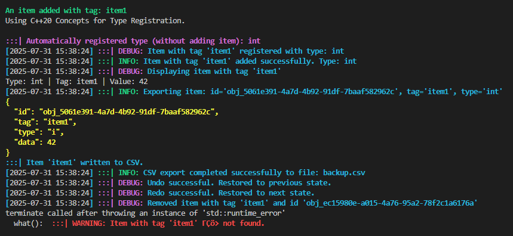
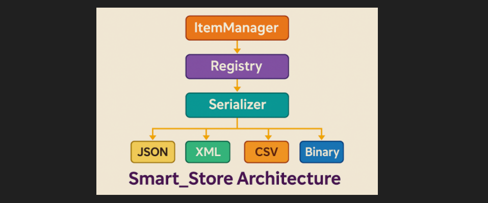

# 🛍️ Smart_Store


<p align="center">
  <b>A High-Performance, Modern C++ Item Manager for Inventory, Asset Tracking, and Data Persistence.</b>
</p>

---

## Overview

<b>Smart_Store</b> is a modular, extensible, and high-performance C++ framework for managing, serializing, deserializing, and organizing complex item data across multiple formats. Perfect for inventory systems, asset management, data editors, and any application needing structured, taggable, and type-safe storage of arbitrary objects.</br>
This isn’t just code, it’s a living system. I designed it to be as intuitive and adaptive as the human body forming from cells.

- [More details](https://github.com/gem870/Smart_Store/wiki#project-summary)

---

## Project Identity
**Smart_Store Framework**   
**Author:** Emmanuel Chibuike Victor   
**Created:** 2025   
**License:** MIT License    

> Smart_Store was built by Victor to solve serialization challenges in C++. It introduces a metadata-driven instantiation model, multi-format serialization (JSON, XML, binary, and more to come), and undo/redo logic—designed for extensibility, performance, and architectural clarity.

---

### Key Features
- **Undo / Redo History** — Safe state rollback with snapshots
- **Versioned Schema Migration** — Upgrade legacy data automatically
- **Multi-Format Import/Export** — JSON, XML, CSV, Binary
- **Dynamic Type Registration** — Add custom types with zero boilerplate
- **Tag-Based Lookup** — Fast, flexible item access
- **Safe Deserialization** — Registered handlers for type safety
- **Extensive Logging** — Color-coded, timestamped debug output
- **Thread-Safe API** — Concurrent access and modification
- **cross-platform** C++ data persistence

---

### GitHub Action
For fast lookup, use GitHub Action and run the 66 Google Test suite with results printed on the console  
by click: [Run Smart_Store Output App](https://github.com/gem870/Smart_Store/actions/runs/16735506400/job/47373371062)   

## Feature Matrix

| Feature                | Status | Description                              |
|------------------------|--------|------------------------------------------|
| Undo / Redo            | ✅     | Safe state rollback through snapshots    |
| JSON Import/Export     | ✅     | Schema versioning & upgrade support      |
| CSV Import/Export      | ✅     | Standard data format compatibility       |
| XML Import/Export      | ✅     | Human-readable, structured format        |
| Binary Import/Export   | ✅     | Compact, efficient persistence           |
| Schema Upgrades        | ✅     | Future-proof with migration strategies   |
| Dynamic Types          | ✅     | Register custom object types easily      |

---

## Technologies

- **C++20** — Modern language features
- **nlohmann::json** — Fast, flexible JSON serialization
- **TinyXML2** — Lightweight XML support
- **Smart Pointers & RAII** — Memory safety
- **Modern STL** — `std::map`, `std::optional`, `std::shared_ptr`
- **Type-Safe Deserialization Registry**
- **Custom Logging Utility** — ANSI color support

---

## Directory Structure


---

## Quick Example

```cpp
#include "t_manager/ItemManager.h"

int main() {
  ItemManager manager;

  manager.addItem(std::make_shared<int>(42), "item1");
  manager.displayByTag("item1");

  manager.exportToFile_CSV("backup.csv");

  manager.undo();
  manager.redo();

  manager.removeByTag("item1");
  manager.displayByTag("item1");

  return 0;
}
```
### Output:  
Below is the expected output illustrating Smart_Store’s tagging and state snapshot behavior in action.


---
### Smart_Store Core Architecture:   
Flow from Item Registration to Export   


| Format | Import | Export  |
|--------|--------|---------|
| JSON   | ✅     | ✅     |
| CSV    | ✅     | ✅     |
| XML    | ✅     | ✅     |
| Binary | ✅     | ✅     |

---

## Why Choose Smart_Store?

- **Modern & Maintainable:** Clean, idiomatic C++20 codebase
- **Zero Boilerplate:** Automatic type registration, use `addItem`
- **No Inheritance Required:** Works with any object type
- **Data Safety:** Undo history ensures you never lose a state
- **Robust Migration:** Built-in schema upgrades for legacy data
- **Multi-Format Ready:** Seamless transitions between formats

---

## Installation

### Windows:
  . Make sure you have CMake and the GCC compiler installed before you run the following commands.</br>
  . If still having issues, set up WSL (Windows Subsystem for Linux) or use a Linux environment </br>
    and run the following commands.

### Linux / macOS:
  . Make sure you have CMake and the GCC compiler installed before you run the following commands.</br></br>


```bash
git clone https://github.com/gem870/Smart_Store.git
cd Smart_Store
mkdir build
cd build
cmake ..
cmake --build .
./TestApp
``` 
  <b>>> If the issue persists or throws a segmentation fault, please reach out via email or GitHub issues.</b>

### Integration
- [Integration guide](https://github.com/gem870/Smart_Store/wiki/Integration)
---

## License

MIT License. See [LICENSE](LICENSE) for details.

---

## Contributing

We welcome contributions from the community! I would appreciate your help, whether it's fixing bugs, suggesting new features, improving documentation, or refactoring code.

### How to Contribute

1. Fork the repository
2. Create a branch for your feature or bugfix
3. Commit your changes with clear messages
4. Open a Pull Request (PR) with a detailed description
5. Ensure your contribution aligns with the project's guidelines

---

## Resources

- [Code of Conduct](https://github.com/gem870/Smart_Store/blob/main/CODE_OF_CONDUCT.md)
- [Contribution Guidelines](https://github.com/gem870/Smart_Store/blob/main/CONTRIBUTING.md)
- [Project Wiki](https://github.com/gem870/Smart_Store/wiki)

---


## Contact
[Email] (ve48381@gmail.com)  
[LinkedIn](https://linkedin.com/in/chibuike-emmanuel-b8b29b269/)  
[Portfolio](https://emmanuelvictor-portfolio.vercel.app)


